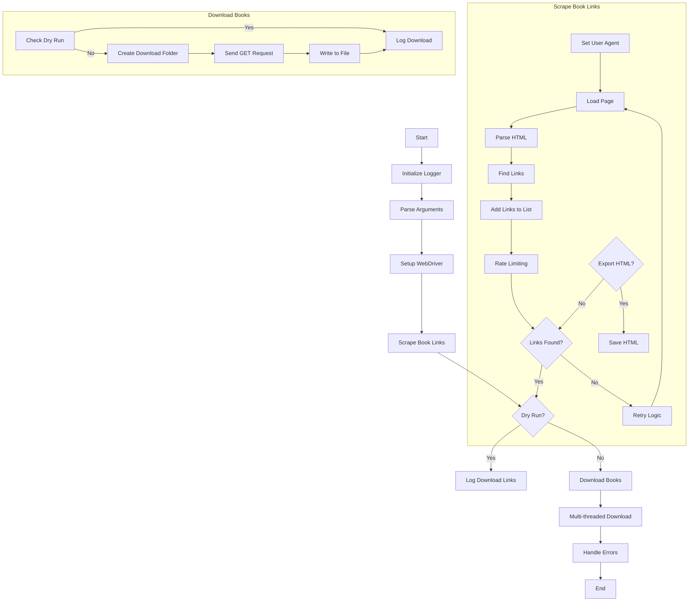

# MotW Scraper

## Overview

This script scrapes the Memory of the World Library for books and downloads them. It uses Selenium to navigate the website and BeautifulSoup to parse the HTML content. The script supports multi-threaded downloading to speed up the process and includes error handling and logging.

## Features

- Scrapes the Memory of the World Library for book links
- Downloads books using multi-threading
- Supports dry run mode to get download links without downloading files
- Configurable download folder
- Logs output to both a file and the terminal
- Handles rate limiting and user-agent randomization to avoid rejected connections

## Requirements

- Python 3.6+
- `beautifulsoup4==4.10.0`
- `selenium==4.1.0`
- `requests==2.26.0`
- `fake-useragent==0.1.11`
- `tqdm==4.62.3`

## Installation

1. Clone the repository:

    ```sh
    git clone https://github.com/yourusername/MotW-Scraper.git
    cd MotW-Scraper
    ```

2. Install the required packages:

    ```sh
    pip install -r requirements.txt
    ```

## Usage

To run the script, use the following command:

```sh
python scraper.py [options]
```

### Options

- `--dryrun`: Get all download links but do not download the files.
- `--path <folder>` or `-p <folder>`: Specify the folder path to download books to (default is `books`).
- `--fast` or `-f`: Disable all cooldowns for faster scraping.
- `--silent` or `-s`: Disable logging output to the terminal.
- `--verbose` or `-v`: Increase verbosity level (can be used multiple times).
- `--pages <number>` or `-pg <number>`: Specify the number of pages to scrape.
- `--export_html`: Enable saving of page source HTML.

### Verbosity Levels

- `--verbose` or `-v`: Increase verbosity level. Can be used multiple times to increase the level of detail in the logs.
  - No `-v`: Only errors are logged to the terminal.
  - `-v`: Info and errors are logged to the terminal.
  - `-vv` or more: Debug, info, and errors are logged to the terminal.
  - The log file will always include info level logs by default, and will include debug level logs if `-vv` or more is used.

### Examples

1. Scrape and download books to the default folder:

    ```sh
    python scraper.py
    ```

2. Scrape and download books to a specified folder:

    ```sh
    python scraper.py --path /path/to/download/folder
    ```

3. Run in dry run mode to get download links without downloading files:

    ```sh
    python scraper.py --dryrun
    ```

4. Run in fast mode to disable all cooldowns:

    ```sh
    python scraper.py --fast
    ```

5. Run in silent mode to disable logging output to the terminal:

    ```sh
    python scraper.py --silent
    ```

6. Run in verbose mode to enable detailed logging output to the terminal:

    ```sh
    python scraper.py --verbose
    ```

7. Scrape a specific number of pages:

    ```sh
    python scraper.py --pages 5
    ```

8. Enable saving of page source HTML:

    ```sh
    python scraper.py --export_html
    ```

## Flowchart



## To Do

- [X] Parse number of pages to avoid a fixed maximum.
- [ ] Metascraping and embedding in downloaded file?
- [X] Add exception handling for requests and webdriver
- [X] Replace print with logging
- [X] Add multi-theading to download multiple files at once
- [ ] Add clean program exit (current displays errors when killing with Ctrl+C)
- [ ] Cleanup found links before sending them for download

## Potential Issues

- ~~Rejected connections due to rate limits, bot detection, etc. May need to increase wait time between scrapes or add user-agent randomization.~~
**Edit: Issues are internal to this codebase and not related to MotW. Currently troubleshooting this...**
